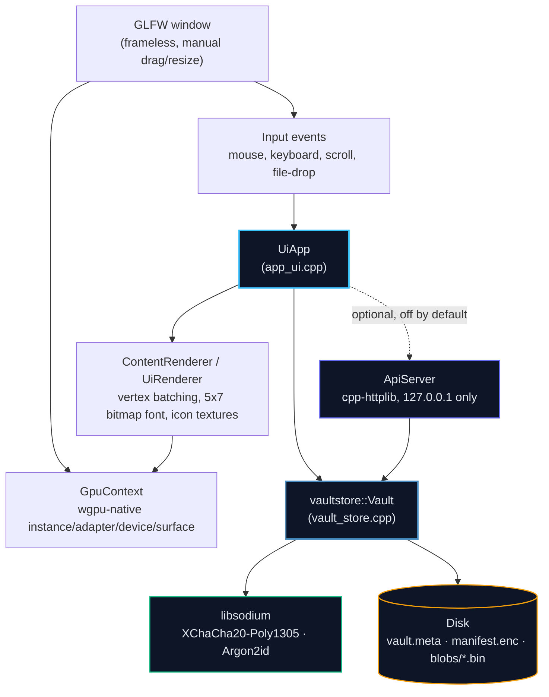

<div align="center">


<a href="#"></a>

<br/>


<br/>


</div>

<br/>

> [!IMPORTANT]
> **CryptVault is a from-scratch native application shell, not a wrapper around a browser or a game engine.** It talks to the GPU directly through wgpu-native, draws its own immediate-mode UI with a bitmap font, and encrypts everything it stores with a real AEAD cipher and a real KDF — not a toy XOR or an "obfuscated" zip. It has not been independently audited. Read [Security Model](#security-model) before trusting it with anything you can't afford to lose.

<br/>

## Table of Contents

- [What is CryptVault?](#what-is-cryptvault)
- [Why This Project Exists](#why-this-project-exists)
- [Feature Overview](#feature-overview)
- [Architecture](#architecture)
- [How a Vault Works](#how-a-vault-works)
- [Encryption Design](#encryption-design)
- [Tech Stack & Rationale](#tech-stack--rationale)
- [Third-Party API](#third-party-api)
- [Repository Structure](#repository-structure)
- [Getting Started](#getting-started)
- [Build Targets](#build-targets)
- [Security Model](#security-model)
- [Known Limitations](#known-limitations)
- [Testing](#testing)
- [Roadmap](#roadmap)
- [Contributing](#contributing)

<br/>

## What is CryptVault?

CryptVault is a small, frameless desktop application for Windows and Linux that stores files inside password-protected, encrypted vaults on your own disk. There is no cloud component, no account, and no background service — a vault is just a directory, and the app is a single executable that knows how to read and write it.

Under the hood it's an experiment in building a native app shell the hard way: no Electron, no Chromium, no game engine, no garbage collector. A GLFW window, a wgpu-native GPU surface, and a hand-written immediate-mode UI drawn with a 5x7 bitmap font — the whole rendering stack is a few thousand lines of C++ that talk to the GPU every frame.

```
Files  →  XChaCha20-Poly1305 (libsodium)  →  opaque blobs on disk
```

Open a vault with the right password and you see folders, tiles, and a tab bar. Anyone without the password sees a directory of randomly-named binary blobs and one small metadata file — no filenames, no folder structure, no file sizes leak without the key.

<br/>

## Why This Project Exists

Most "encrypted vault" apps on the desktop are either thin wrappers around OS-level disk encryption (BitLocker/LUKS — whole-volume, not per-file, not portable) or Electron apps that ship an entire Chromium runtime to render a password box. Neither answers a narrower question this project set out to explore: **what does it take to build a small, native, GPU-rendered application from first principles**, with a real encryption engine underneath, and no framework doing the hard parts for you?

That meant writing the window/input layer, the GPU surface setup, the immediate-mode UI renderer, and the vault storage engine all by hand, then wiring them together into something that's actually usable day to day — not just a rendering demo. The vault engine in particular (see [Encryption Design](#encryption-design)) is written and documented as if it were the security-critical component of a real product, because getting that part right is the actual point of the exercise.

<br/>

## Feature Overview

Everything below reflects what's implemented in the current source, not a wishlist.

### Vault management

| Feature | Notes |
|---|---|
| Create a new vault (name, location, password) | Guided multi-step wizard with a native OS folder picker |
| Open / lock a vault | Password re-entry required after locking; nothing stays decrypted in memory while locked |
| Change a vault's password | Re-wraps the master key only — does not touch or re-encrypt existing file content (see [Encryption Design](#encryption-design)) |
| Multiple vaults, multiple tabs | Each open vault gets its own tab; folders inside a vault are navigated tile-grid style |

### Working inside a vault

| Feature | Notes |
|---|---|
| Folders, nested arbitrarily deep | Tile-grid browsing with breadcrumb-style back/up navigation |
| Add files by drag-and-drop from the OS | Encrypted into the vault immediately on drop |
| Open a file | Decrypts to a temporary location and hands it to the OS's default application for that file type |
| Rename / delete | Delete on a folder recursively removes every blob underneath it, not just the manifest entry |
| Search | Filters the current folder's tiles as you type |
| Right-click context menu | Per-tile actions (rename, delete, open) |

### Application shell

| Feature | Notes |
|---|---|
| Frameless window with a custom border | No OS title bar; drag-to-move and a resize-toggle button are hand-implemented |
| Command palette | Keyboard-driven action launcher, fuzzy-matched against a fixed command list |
| Settings panel | Toggle for the third-party API (see below), a "clear all data" destructive action with a confirmation modal |
| Always-on-top toggle | Border right-click menu |
| Toast notifications | Transient confirmations for created/deleted/renamed actions |

### Third-party API (opt-in, off by default)

A local-only HTTP server that lets another process on the same machine read and write files inside vaults you already have unlocked in the app. See [Third-Party API](#third-party-api) for the full contract.

<br/>

## Architecture



`main.cpp` owns the window, the GPU device, and the process's one real clock; it drives the UI once per frame through a small, C-ABI-shaped entry-point surface (`UiAppCreate` / `UiAppBeginFrame` / `UiAppEndFrame`) rather than calling into UI internals directly, which keeps the render loop and the UI implementation as two independently reasoned-about pieces even though they're compiled into one binary. The vault storage engine (`vault_store.cpp`) has no dependency on GLFW, wgpu, or the UI at all — it can be built and exercised completely headless (see [Testing](#testing)).

<br/>

## How a Vault Works

A vault is a directory. Nothing is stored outside it, and nothing outside libsodium's own randomness is required to recreate one on another machine.

```text
<vault-dir>/
  vault.meta       small header: format version, Argon2id salt/cost
                   params, and the master key wrapped under a
                   password-derived key
  manifest.enc     the entire folder tree — real names, structure,
                   which blob backs each entry — encrypted as one
                   blob
  blobs/
    <random-id>.bin   one independently-encrypted blob per file,
                       named with no relationship to the real
                       filename
```

Opening a vault decrypts `manifest.enc` once (revealing the folder tree in memory) but leaves every file's content encrypted at rest until that specific file is opened. Locking a vault drops the decrypted tree and the derived keys from memory.

<br/>

## Encryption Design

**Two-layer key model:**

```
password --Argon2id(salt)--> KEK (key-encryption key)
KEK --AEAD-decrypt--> MK (master key, random, generated once at creation)
MK encrypts manifest.enc and every blob
```

The master key is never derived from the password — it's generated once, randomly, when a vault is created, and only ever exists wrapped (encrypted) under a key derived from the current password. This is what makes changing a password cheap: `ChangePassword` re-derives a new KEK with a fresh salt and re-wraps the same master key under it. `manifest.enc` and every file blob are untouched — no bulk re-encryption of vault content on a password change.

| Primitive | Choice | Why |
|---|---|---|
| AEAD cipher | XChaCha20-Poly1305 (`crypto_aead_xchacha20poly1305_ietf`) | Authenticated — detects tampering, not just decrypts. 24-byte nonces are large enough to generate randomly per encryption without a realistic collision risk, unlike AES-GCM's 96-bit nonces, which need a counter (or similar bookkeeping) to stay safe at scale. |
| KDF | Argon2id (`crypto_pwhash`), INTERACTIVE cost | Memory-hard password stretching. Deliberately not MODERATE/SENSITIVE cost today, since unlock currently runs synchronously on the UI thread — worth revisiting if unlock moves off-thread. |

**What this defends against:** someone with access to the vault directory itself — a stolen drive, a synced cloud backup, another account on a shared machine — reading file contents, filenames, or folder structure without the password.

**What this does not defend against:** malware already running as you while a vault is unlocked (it can read decrypted content or your password the same way you can), or someone watching you type the password. No software-only vault can close that gap — it isn't a shortcoming specific to this implementation.

A wrong password and a corrupted vault are made to look identical on failure, on purpose — an attacker shouldn't be able to learn anything about *why* an unlock attempt failed.

<br/>

## Tech Stack & Rationale

<table>
<tr><th>Layer</th><th>Chosen</th><th>Why</th></tr>

<tr>
<td><b>Windowing / input</b></td>
<td>GLFW 3.4 (fetched from source)</td>
<td>Small, well-understood, cross-platform surface for window creation and raw input, without pulling in a full application framework.</td>
</tr>

<tr>
<td><b>GPU / rendering</b></td>
<td>wgpu-native (WebGPU → D3D12 on Windows, Vulkan on Linux)</td>
<td>One graphics API surface instead of maintaining separate D3D12 and Vulkan backends by hand, while still talking to the GPU directly — no engine, no scene graph, no retained-mode widget toolkit.</td>
</tr>

<tr>
<td><b>UI rendering</b></td>
<td>Hand-written immediate-mode renderer + 5x7 bitmap font</td>
<td>The entire UI is redrawn from application state every frame, batched into vertex buffers and submitted in one render pass — no DOM, no retained widget tree to keep in sync.</td>
</tr>

<tr>
<td><b>Encryption</b></td>
<td>libsodium, vendored via a CMake wrapper</td>
<td>Audited implementations of XChaCha20-Poly1305 and Argon2id instead of hand-rolled cryptography — the single highest-leverage dependency choice in the project.</td>
</tr>

<tr>
<td><b>Local API transport</b></td>
<td>cpp-httplib (single header)</td>
<td>Minimal dependency footprint for a server that only ever needs to bind <code>127.0.0.1</code> and serve a handful of routes.</td>
</tr>

<tr>
<td><b>Build system</b></td>
<td>CMake 3.20+, with GLFW/libsodium/cpp-httplib fetched at configure time</td>
<td>Nothing to preinstall beyond a compiler and CMake itself — every dependency source is pulled and built as part of the same configure step.</td>
</tr>

</table>

<br/>

## Third-Party API

Off by default — toggled on from the Settings panel. When enabled, CryptVault runs a local-only HTTP server so another process on the same machine can read and write files inside vaults you already have unlocked, without ever handling your password itself.

**Design constraints, by construction:**

- Binds `127.0.0.1` only, on an OS-assigned port — never a fixed port, never any other interface.
- Authenticated with a random bearer token, regenerated every time the server (re)starts.
- Has no password-checking path of its own and no way to unlock a vault — it can only ever see what's *already* unlocked in the running app.
- Publishes its port and token to a small local discovery file (owner-read/write only) while running, and removes it when the server stops — the same idea as how tools like Jupyter publish their own connection info.

| Method | Route | Auth | Purpose |
|---|---|:---:|---|
| `GET` | `/v1/ping` | none | Liveness check |
| `GET` | `/v1/vaults` | bearer | Currently-unlocked vaults: `[{index, name}]` |
| `GET` | `/v1/vaults/{index}/tree` | bearer | That vault's decrypted folder tree |
| `GET` | `/v1/vaults/{index}/file?path=..` | bearer | A file's decrypted bytes |
| `POST` | `/v1/vaults/{index}/file?path=..` | bearer | Encrypts the request body as that file; the parent folder must already exist — this never auto-creates folders |

<br/>

## Repository Structure

```text
CryptVault/
├── CMakeLists.txt
├── assets/
│   ├── background.png
│   └── icons/
├── src/
│   ├── main.cpp              # process shell: window, GPU device, frame loop
│   ├── debug_repro.cpp       # scripted-input harness for reproducing UI bugs
│   ├── window/                # GLFW wrapper
│   ├── gpu/                   # wgpu-native surface setup
│   ├── ui/
│   │   ├── app_ui.cpp/.h      # application state, screens, ApiServer
│   │   ├── ui_renderer.cpp/.h # immediate-mode drawing primitives
│   │   ├── animation.h
│   │   └── font5x7.h
│   ├── vault/
│   │   ├── vault_store.cpp/.h # encrypted vault engine
│   │   └── vault_store_test.cpp
│   └── platform/               # folder picker + "open with OS default app"
│                                 (Windows / Linux implementations)
└── LICENSE
```

<br/>

## Getting Started

### Prerequisites

- CMake 3.20+
- A C++17 compiler (MSVC on Windows, GCC/Clang on Linux)
- The matching wgpu-native binary for your platform (see the comment at the top of `CMakeLists.txt` for the pinned version and where it's expected on disk)

### Build

```bash
cmake -B build -DCMAKE_BUILD_TYPE=Release
cmake --build build --config Release
```

Icon assets are copied next to the built binaries automatically as part of the build. On first run, launch the resulting `cryptvault` executable — no separate install step, no service to start.

<br/>

## Build Targets

| Target | Purpose |
|---|---|
| `cryptvault` | The application itself |
| `debug_repro` | A diagnostic harness that drives the UI with scripted synthetic input (no real mouse/keyboard) to reproduce reported bugs deterministically, and inspect internal state via a debug dump |
| `vault_store_test` | Headless test/demo executable for the encryption engine alone — no GLFW, no wgpu, no UI dependency at all |

<br/>

## Security Model

### Implemented

- Real AEAD encryption (XChaCha20-Poly1305) for every file blob and the folder manifest, not just the vault's password check
- Argon2id password stretching before any key derivation
- A two-layer key model so password changes never require re-encrypting vault content
- Filenames and folder structure encrypted along with file contents — a locked vault directory reveals nothing but a count of opaque blobs
- Wrong-password and corrupted-vault failures made indistinguishable on purpose
- The third-party API is off by default, loopback-only, token-authenticated, and structurally unable to unlock a vault itself

### Not implemented

- Independent third-party security audit
- Encrypted memory / secure-erase guarantees on decrypted content held in RAM while a vault is unlocked
- Any defense against malware already running as the same user while a vault is unlocked
- Multi-user or multi-device sync — a vault is a plain local directory; anything more is up to the OS or the user's own backup tooling

<br/>

## Known Limitations

- Argon2id currently runs at INTERACTIVE cost, synchronously on the UI thread — unlocking a vault briefly blocks the UI; moving this off-thread would allow raising the cost parameters without a visible stall.
- No macOS build target yet — the platform-specific folder picker and "open with OS default app" code only has Windows and Linux implementations.
- `debug_repro` is a temporary diagnostic tool checked into the main build graph, not gated behind a separate build option.

<br/>

## Testing

`vault_store_test` exercises the encryption engine directly, independent of any GPU or windowing code — it can build and run in a plain headless environment to verify creation, unlock, folder/file operations, and password changes round-trip correctly before (or without) touching anything screen-related.

`debug_repro` drives the real UI code through the same entry points `main.cpp` uses, with a scripted sequence of synthetic input frames (clicks, double-clicks, typed text) instead of live mouse/keyboard events, so a reported UI bug can be reproduced the same way every time and inspected via its debug-dump output rather than guessed at from reading code alone.

<br/>

## Roadmap

- [ ] Move Argon2id unlock off the UI thread, and raise the cost parameters once it is
- [ ] macOS support for the platform-specific folder picker / open-file code
- [ ] Promote `debug_repro` behind an explicit, opt-in build option
- [ ] Expand the third-party API surface (folder creation, delete, rename) if a real use case for it emerges

<br/>

## Contributing

Issues, pull requests, and design discussions are welcome — especially around the encryption engine and the third-party API's threat model, since those are the parts most worth a second pair of eyes.

<br/>

<div align="center">


**Files stay local. Only what a valid password can decrypt is ever readable.**

</div>